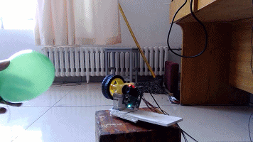

# 说明

这个仓库的名称为“颜色跟踪云台”，曾用于在2016/06/25参加校内制作比赛。

功能说明：[PixyCam](https://pixycam.com/)摄像头采集移动气球在画面中的像素坐标位置，并将坐标通过串口发送给stm32，stm32通过平滑滤波后使用增量式 pid 算法用 pwm 方波控制电机追踪气球，使气球始终位于画面中心。

# 代码

code目录下放置了程序源码，这是一份粗糙的代码。

# 其他：

- [效果演示gif](./doc/颜色跟踪云台-演示.gif)
- [简略的ppt](./doc/2016颜色跟踪装置比赛PPT.pptx)
- [关于增量式pid的简单说明](./doc/2.增量式PID.md )

