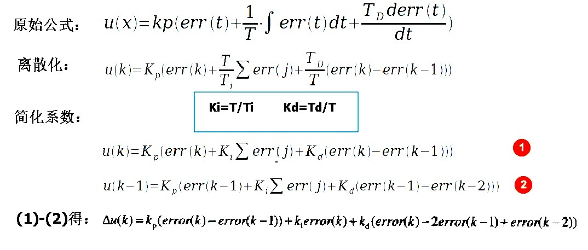

# 1.什么是 PID？

PID属于无模型控制，PID就是对输入偏差进行比例积分微分运算，运算的叠加结果去控制执行机构。

- P 就是比例，就是输入偏差乘以的那个系数
- I  就是积分，就是对输入偏差进行积分运算
- D 就是微分，对输入偏差进行微分运算

# 2.增量式pid代码实现

## 2.1公式推导



## 2.代码实现

```c
/**
 * @brief 定义pid参数
 */
typedef struct
{
    float aim;        /* 定义目标值               */
    float err;        /* 定义偏差                 */
    float errNext;    /* 定义上一个偏差值         */
    float errLast;    /* 定义最前的偏差值         */
    float Kp, Ki, Kd; /* 定义比例，积分，微分系数 */
}PIDType;

/*
 * @brief      pid参数初始化
 * @param[in]  p : pid参数结构体指针
 * @return     void
 */
void initPID(PIDType * p)
{
    p->aim = 0.0;
    p->err = 0.0;
    p->errLast = 0.0;
    p->errNext = 0.0;
    p->Kp = 0.6;
    p->Ki = 0.015;
    p->Kd = 0.20;
}

/*
 * @brief      计算增量
 * @param[in]  p : pid参数结构体指针
 * @param[in]  realVal : 真实值
 * @param[out] pIncremental : 计算的增量值
 * @retval     true : success
 * @retval     false : failed
 */
void calculateIncrement(PIDType * p, float realVal, float * pIncremental)
{
    p->err = p->aim - realVal;

    *pIncremental = p->Kp * (p->err - p->errNext) + p->Ki * p->err + p->Kd * (p->err - 2 * p->errNext + p->errLast);

    p->errLast = p->errNext;
    p->errNext = p->err;
}

```

